---

## ⚡ Engine Stats

## 🔥 Consistency Graph

## 🎯 Strategic Targets
| Objective | Mastery Level | Tracking |
| :--- | :--- | :---: |
| **Striver A2Z Sheet** |  | `⚡ __vikram: 19%` |
| **LeetCode 500+** |  | `🧩 Solved: 104` |
| **CF Rating 1200** |  | `🏆 Active` |

## 🕒 Recent Activity (Last 2 Days)
| Problem | Platform | Difficulty | Date |
| :--- | :--- | :---: | :---: |
| [[Walking Robot Simulation II](https://leetcode.com/problems/walking-robot-simulation-ii/)](#) | LeetCode | `Medium` | 07 Apr |
| [[A. Sequence Game](https://codeforces.com/problemset/problem/2164/A)](#) | Codeforces | `800` | 07 Apr |
| [[Walking Robot Simulation](https://leetcode.com/problems/walking-robot-simulation/)](#) | LeetCode | `Medium` | 06 Apr |
| [[3Sum Closest](https://leetcode.com/problems/3sum-closest/)](#) | LeetCode | `Medium` | 06 Apr |
| [[A. Ambitious Kid](https://codeforces.com/problemset/problem/1866/A)](#) | Codeforces | `800` | 06 Apr |

**System Last Sync:** `08 Apr 2026 | 02:38 PM IST`
